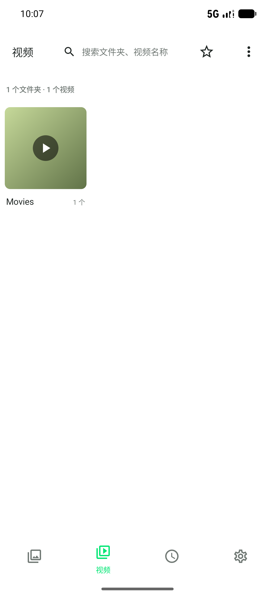

# Album

一个面向 Android 的本地图片、视频与壁纸管理器，使用 Kotlin 和 Jetpack Compose 构建。

Album 主要服务于希望直接管理本机媒体文件的用户：不上传媒体、不依赖云端相册，并提供比系统相册更完整的整理、编辑和播放入口。

## 功能

- 图片和视频按文件夹、相册、时间轴浏览
- 收藏、搜索、排序、批量选择与批量操作
- 使用 MediaStore 和 Storage Access Framework 移动、复制和删除媒体
- 回收站、重复图片检测和文件夹排除
- 图片裁剪、旋转、调整和保存副本
- 视频播放、播放进度记忆、后台播放和画中画
- 静态/动态壁纸队列、裁剪、轮播和低功耗模式
- Pixiv 登录后按作品、画师和 Tag 归档下载的图片
- 接收系统分享（其他应用"分享到 Album"后选择文件夹导入）
- 导出/导入应用数据（收藏、队列、排除文件夹与偏好设置）
- 收藏跟随文件改名与移动（不再因为 URI 变化而丢失）
- 中文和英文界面

## 截图

| 相册 | 编辑器 | 视频 |
| --- | --- | --- |
|  |  |  |

## 下载

- [GitHub Releases](https://github.com/Tnomlav/ALbum/releases)
- 最新已发布版本：[v1.1.50 APK](https://github.com/Tnomlav/ALbum/releases/download/v1.1.50/Album-v1.1.50.apk)
- 下一个发布版本（`version.properties` 中的唯一版本来源）：`1.2.1`

本地签名构建产物位于 `app/release/`，仅用于交付前验证，不纳入版本控制（历史上的提交把每个版本的 APK 都存进了仓库，仓库因此膨胀到 200 MB 以上）。当前本地验证构建为 `1.2.8`（arm64-v8a 分包，其余架构见构建输出目录 `app/build/outputs/apk/release/`），其 SHA-256 为：

```text
E7C290E0AD77682DB4B81ACC8482E028BBBB52C700A2EF81312102B039D1F2C0
```

安装前请确认文件来自本仓库，并通过 SHA-256 校验下载完整性。正式发布版本和发布说明会优先放在 GitHub Releases。

README 中的"下一个发布版本"与仓库内 APK 的版本可能不一致：APK 只在执行签名 release 构建时更新，构建成功后 `version.properties` 会自动把 patch 号加一。版本号只在 `version.properties` 维护，不要在本文件或 `app/release/output-metadata.json` 中手工修改。

## 要求

- Android 7.0（API 24）或更高版本
- Android Studio，或 JDK 17 与项目自带 Gradle Wrapper
- 图片/视频访问权限；移动、复制和 Pixiv 归档功能可能需要额外的文件夹访问授权

应用只在执行对应功能时请求权限。媒体库默认读取设备上的图片和视频；Pixiv 归档功能会访问 Pixiv 网络服务并使用应用内登录状态。

## 构建

```bash
git clone https://github.com/Tnomlav/ALbum.git
cd ALbum
./gradlew lintDebug testDebugUnitTest assembleDebug
```

Windows PowerShell：

```powershell
.\gradlew.bat lintDebug testDebugUnitTest assembleDebug
```

生成的 Debug APK 位于 `app/build/outputs/apk/debug/`。Release 签名配置通过 Gradle 属性提供，不应把 keystore 或密码提交到仓库：

```text
ALBUM_STORE_FILE
ALBUM_STORE_PASSWORD
ALBUM_KEY_ALIAS
ALBUM_KEY_PASSWORD
```

构建默认按 ABI 拆分，因为 AVI 播放使用的 LibVLC 每个架构约 60 MB 原生库。每个设备只需要安装自己架构的包：

```text
app/build/outputs/apk/debug/app-arm64-v8a-debug.apk      # 现代手机
app/build/outputs/apk/debug/app-armeabi-v7a-debug.apk    # 32 位 ARM 设备
app/build/outputs/apk/debug/app-x86_64-debug.apk         # 模拟器
```

用 Android Studio 直接运行时会自动选择匹配的架构。手动 `adb install` 时请选择与设备 CPU 对应的 APK。需要单个全架构包时加上 `-PalbumUniversalApk=true`（体积约为单架构包的 3–4 倍）。压缩原生库会增加 Gradle 打包内存占用，`gradle.properties` 已把堆上限调到 4 GB。

## 发布

版本号只保存在 `version.properties`。完整步骤（构建、生成更新清单、打标签、创建 Release、发布后自检）见 [RELEASING.md](RELEASING.md)。应用的更新检查地址由 `ALBUM_UPDATE_URL` 配置，默认指向 `releases/latest/download/album-update.json`，也就是最近一次发布附带的清单资产，而不是任何分支上的文件。

## 产品成熟度

当前版本距离"成熟可用产品"还差什么、优先级清单与验收标准，见 [产品成熟度全盘复盘](docs/product-readiness-review.md)。

## 第三方组件

随包分发的第三方组件与其许可（LibVLC 的 LGPL-2.1、内置字体的 OFL-1.1 等）见 [THIRD_PARTY_NOTICES.md](THIRD_PARTY_NOTICES.md)，也可在应用内**设置 → 关于 → 开源许可**离线查看。

## 开发素材

`dev-assets/` 中的图片和视频仅用于本地 UI、媒体扫描和播放测试。导入模拟器的命令见：

```powershell
.\scripts\import-sample-videos.ps1
```

## 隐私与第三方服务

Album 不提供云端媒体同步。Pixiv 归档是可选功能，会连接 Pixiv 以读取公开作品信息；请遵守 Pixiv 的服务条款、版权要求和所在地法律。项目不应提交真实账号 Cookie、个人媒体或私有密钥。

## 贡献

欢迎提交 Issue 和 Pull Request。提交前请先运行 `./gradlew lintDebug testDebugUnitTest assembleDebug`，并在行为或界面变化时附上复现步骤、设备版本和截图。

## License

本项目使用 [MIT License](LICENSE)。
